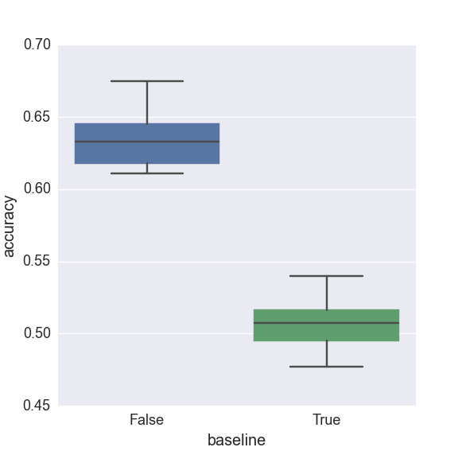
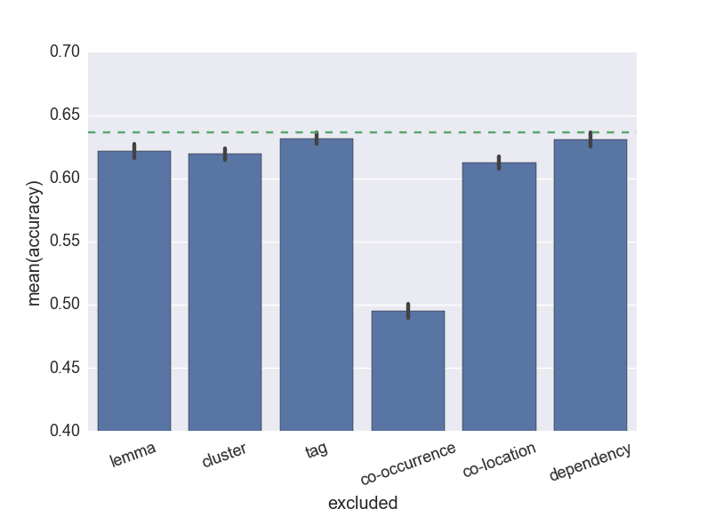
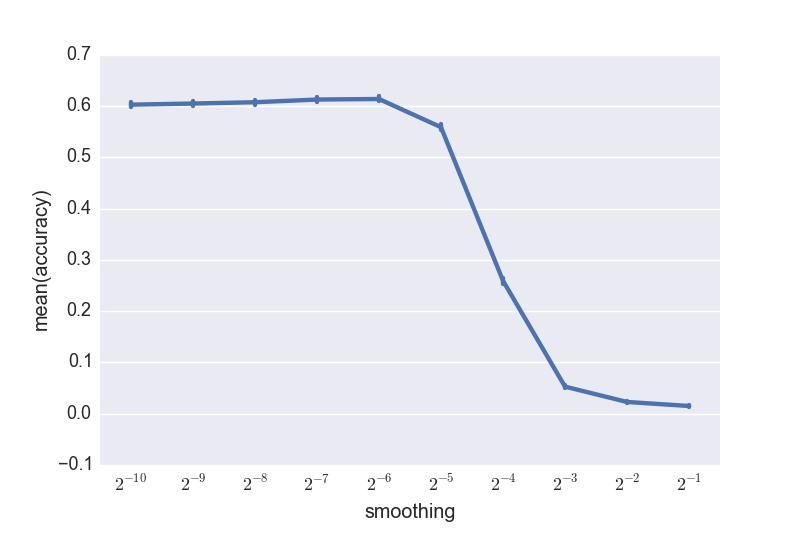
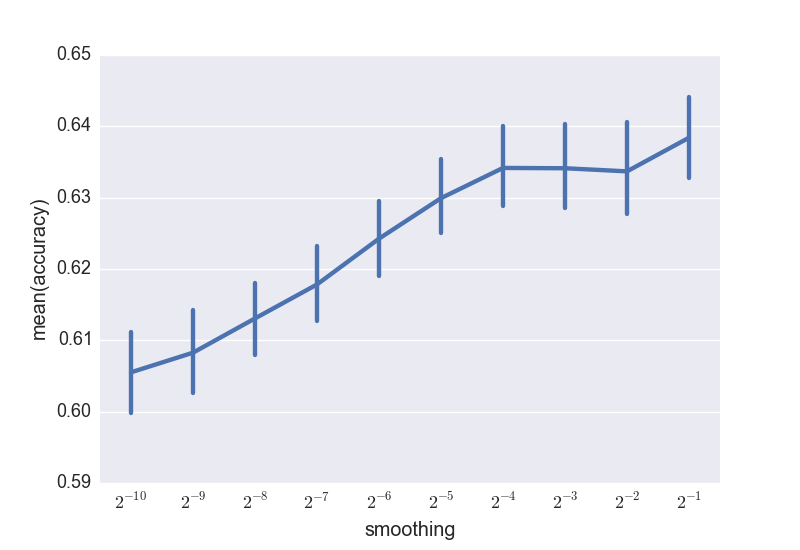

## 1. Approach

### Training
We implemented the Naive-Bayes model to perform supervised WSD.
Our basic approach to the task begins with parsing the given XML training data into a list of tuples of the form *(context, sense)*, which is done in our `get_training_data()` function. Because we must predict the exact combination of senses of a word, we simply concatenate all the sense that a word is tagged with, ignoring the relationship between individual senses and combined senses in the interest of simplicity. Once the data is cleaned and extracted, the training data is passed to the `Disambiguator` class.

Fitting the model consists of creating a `SparseMatrix` for the data where rows represent senses and columns represent features. These features are extracted in the `extract_features()` function, which tokenizes the given contexts and returns co-occurrence, collocation, and dependency features as a set of featureIDs. We use the Spacy library to extract all linguistic features. This library is appealing because (1) it is the fastest open source dependency parser, (2) it attains state-of-the-art accuracy, and (3) it provides a unified interface to many useful nlp features such as brown clusters and word vectors. For each of these word types, we consider lemma (i.e. normalized word form) and brown cluster. We additionally consider the penn treebank tag for co-locations.

We consider three types of words as being relevant:

- Co-occurrence anywhere in a context
    - ex. Target word: "ball", two senses: sports and dance/party. An instance of "ball" which co-occurs in context with "player" and "run" is more likely to be of the sports sense then the dance/party sense.
- Collocation features extracted from the two words before and after the target word (the target word $w_i$, as well as $w_{i-2}$, $w_{i-1}$, $w_{i+1}$, $w_{i+2}$) 
    - ex. Target word($w_i$): "bank", two senses: river and financial. An instance of "bank" with $w_{i-2}$ = "on" is more likely to be of the river sense (i.e. "I was on the bank.") whereas an instance with $w_{i-2}$ = "in" is more likely to be of the financial sense (i.e. "I was in the bank.").
- Syntactic dependencies for the target word
    - ex. Target word: "button", two senses clothing or functional/pushable button. An instance of "button" as shown below is the direct object of the verb "click", which is more likely to associate it with the functional/pushable button than the clothing "button" which you would expect to be acted upon by a word like "fasten".
   

For each of these types of words, we can pull features of part-of-speech tags, lemma, and Brown clusters to support our model. Examples of why each is helpful are given below.

- The target word is tagged as `NOUN`. This could distinguish between the two senses of "bank".
- The lemma of the subject of the target word is "stick". This could
   distinguish between two senses of the word "snap": the hand gesture
   vs. breaking.
- A word with Brown cluster 1061 occurs in the context. For example, the model may have learned to associate "friend" with one sense of the word "bar". It can then use this information when it sees the word "buddy" in the context of a test case.

After extracting the features, for every row (sense) in the matrix, we fill in the feature columns with counts of each feature by sense.  The counts are smoothed with Add-*k* smoothing and  the smoothed matrix is the model with which we classify the senses of the test data.

### Classification

Once the model is trained, the test data is passed to the model for word sense classification.

The test context features are extracted as described above, and the surprisals (negative log probabilities) of the senses in our training matrix are calculated. This is equal to $-log(P(s|\vec{f}))$ where $P(s|\vec{f}) \propto P(\vec{f}|s)P(s)$  and $P(\vec{f}|s)$ is simply the product of all individual feature probabilities. The model chooses the least surprising, or most probable sense.

Our final model employs add-*k* smoothing and normalization, thus these statistical descriptions are approximate. Probabilites are smoothed and then required to sum to 1 for each sense. (Details in discussion). Thus our classifier is described fully by the following:

$$\arg\!\min_s \sum_f - \log \text{normprob}(f|s)$$

## 2. Software

*List any software that your system uses, but you did not write by yourself. Make clear which parts of system rely on the software if it is not obvious.*
 
 - [Spacy](https://spacy.io) to extract word lemmas, brown clusters, parts of speech, and syntactic dependencies
 - XML Element Tree to extract and parse XML data
 - seaborn for graphs

## 3. Results
We achived an accuracy of 0.63235 on the final kaggle test set, putting us in first place (with the pseudonym *jake_sousa_learning*, in honor of a dear friend). Comparing the model to a baseline model that always predicts the most frequent sense, we find that our method performs significantly better.

## 4. Discussion
We experimented with many different parameters to achieve this score. To compare performance with different parametr configurations, we employed cross validation, training on 90% of the data and validating on the remaining 10%. For each parameter configuaration, we cross validate 30 times (with random validation sets), giving us distributions of performance. Using this cross validation technique we explored the eppect of feature selection and smoothing on our results.

### Features
In order to quantify the relative effects of each family of features, we ran five impaired versions of the models with one kind of feature removed. Note that the three features on the right refers to the position of a word, while those on the left refer to a type of information to extract from the word. Surprisingly, our linguistically informed features seem to play a relatively minor role. This may be due to data sparsity or perhaps our misuse of the features.

### Smoothing
In contrast to the minimal impact of the linguistic features, our models performance is highly dependent on the way smoothing is implemented. Most features extracted from a test context will have never occurred for most senses of a word, thus the smoothed probability of unseen features play a major role. Seeing the similarity between a matrix of bigram counts and a matrix of sense-feature counts, we reused code from project 1 and thus began with good turing smoothing, leading to disasterous performance. Specifically, our model selectively chose the least probable sense by base rate! 

Our first attempt to handle this problem was to remove infrequent features from the calculations using a `drop_threshold` parameter. This made little impact. At the advice of Dr. Cardie, our next strategy was to replace good turing with add-*k* smoothing, using a very small *k*. Intuitively, rare senses will be seen with fewer features, and thus will benefit more from smoothing. Indeed this strategy was quite successful, giving us performance above baseline. 

Despite this initial success, lowering the smoothing paramater came at the cost of decreased generalizability. In addition to handling the mathematical problem of zero probabilities, smoothing makes the models representations slightly fuzzier, and thus less prone to overfitting. With this in mind, we sought alternative strategies to prevent rare senses from dominating. 

Examining the sense-feature probability matrix, we found that the average feature probability was higher for some senses than others. This means that a random set of features will more likely to be classified as some senses, regardless of base rates. It appears that weakening smoothing was a superficial fix for this more fundamental problem. We found that high smoothing values lead to rare senses having much higher feature probabilities, explaining the models tendency to select the rare features. However, even after weakening smoothing, the senses were not all equal. For example, a sense that tended to occur in shorter contexts was associated with fewer co-occurrence features on each observation, and thus had a lower average $p(feature | sense)$.

To address this concern, we normalized the sense-features probability matrix such that the feature probabilities sum to 1 for each sense (see `SparseMatrix.normalized_probabilities`). If there were no smoothing, this would be equivalent to using the probability of sampling a feature from a context, rather than the probability of the feature being present (among others) in a context. This equivalence breaks down when we normalize smoothed probabilities, but the effect is the same: the probability of classifying a random set of features as some sense is equal to the base rate of that sense. We were then able to tune the smoothing parameter to an ideal value without the concern of inflating rare senses. We found that smoothing values between 0.1 and 0.3 performed well and thus submitted three models with values in this range to Kaggle in the hopes that one of them would hit the sweet spot for the test set.

